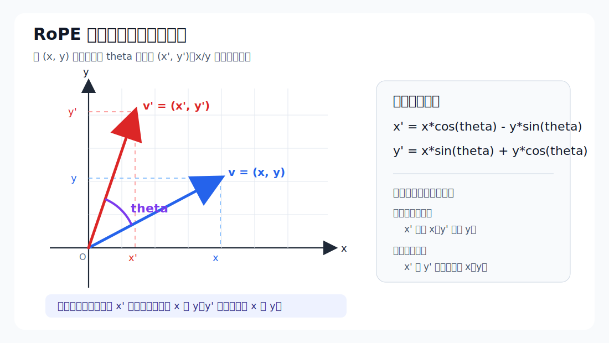

# RoPE 为什么只是高中三角函数：把 Q/K 向量按位置旋转

上一篇把 QKV 投影拆清楚了：

```text
X -> Q/K/V
Q: [S, 3584] -> [S, 28, 128]
K: [S,  512] -> [S,  4, 128]
V: [S,  512] -> [S,  4, 128]
```

这篇继续往后走一步，只讲 RoPE。

RoPE 的全名是 Rotary Position Embedding，旋转位置编码。名字看起来很吓人，但核心数学只有一件事：

```text
把向量里的每两个维度当成一个二维坐标，然后按 token 位置旋转一个角度。
```

这就是高中三角函数里的平面旋转。

读完这篇，你要能回答 `W1-Q4` 的追问：

```text
RoPE 为什么高中三角函数就够了？
```

答案应该压缩成：

```text
RoPE 作用在 Q 和 K 上。
它把 head 向量按二维一组做旋转：
x0' = x0*cos(theta) - x1*sin(theta)
x1' = x0*sin(theta) + x1*cos(theta)
theta 由 token position 和维度频率决定。
Q/K 点积时，相对位置会自然进入 attention score。
```

下面一步步拆。

## 1. 为什么 attention 需要位置信息

Transformer 的 attention 本质上是在问：

```text
当前 token 应该看哪些历史 token？
```

它用 Q 和 K 做匹配：

```text
score = Q @ K^T
```

score 越大，说明这个 Query 和那个 Key 越匹配。

但有个问题：纯 attention 本身不天然知道顺序。

如果只给模型一堆 token 向量：

```text
我 / 爱 / 北京
```

和：

```text
北京 / 爱 / 我
```

里面的 token 集合很像，但顺序完全不同。语言里顺序当然重要。模型必须知道每个 token 是第 0 个、第 1 个，还是第 100 个。

位置编码就是为了解决这件事：

```text
把 token 的位置信息注入模型计算。
```

早期 Transformer 用的是加法位置编码：

```text
hidden = token_embedding + position_embedding
```

RoPE 不这么做。RoPE 更巧一点：它不直接把位置向量加到 hidden 上，而是把位置变成一个旋转角度，作用在 Q 和 K 上。

## 2. RoPE 作用在哪：只作用在 Q 和 K

在 Qwen2 的一层 attention 里，顺序是：

```text
hidden -> Q/K/V 投影
Q -> RoPE
K -> RoPE
V -> 不做 RoPE
```

为什么是 Q/K，不是 V？

因为 attention 的匹配分数来自：

```text
Q @ K^T
```

位置应该影响的是：

```text
谁和谁更该匹配？
```

所以位置进入 Q 和 K。

而 V 的角色是：

```text
如果我被选中，我贡献什么内容？
```

V 是被 softmax 权重加权汇总的内容载体，不负责产生匹配分数。所以 RoPE 通常不直接作用在 V 上。

这句话很适合当验收答案：

```text
RoPE 只转 Q/K，因为 Q/K 决定 attention score；V 是内容，不决定匹配。
```

## 3. 先把 cos 和 sin 捡回来

如果你已经忘了三角函数，先不要把 `cos` 和 `sin` 当成复杂公式。这里先把它们当成一个很朴素的东西：

```text
cos(theta) = 一个长度为 1 的箭头，转了 theta 角之后，在 x 轴上的坐标
sin(theta) = 同一个箭头，转了 theta 角之后，在 y 轴上的坐标
```

更短一点：

```text
cos 看横向有多少
sin 看纵向有多少
```

想象一个长度为 1 的箭头，从原点出发，先指向右边：

```text
y
↑
|
|
O --------→ x
```

这时候它的终点坐标是：

```text
(1, 0)
```

意思是：

```text
x 方向走了 1
y 方向走了 0
```

所以：

```text
cos(0°) = 1
sin(0°) = 0
```

如果把这个长度为 1 的箭头逆时针转 90°，它会指向正上方：

```text
y
↑
|
|
O
```

这时候终点坐标变成：

```text
(0, 1)
```

也就是：

```text
cos(90°) = 0
sin(90°) = 1
```

先只记这张表就够用：

```text
角度      箭头终点       cos      sin
0°        (1, 0)         1        0
90°       (0, 1)         0        1
180°      (-1, 0)       -1        0
270°      (0, -1)        0       -1
```

这张表背后的意思是：

```text
箭头朝右：横向是 1，纵向是 0
箭头朝上：横向是 0，纵向是 1
箭头朝左：横向是 -1，纵向是 0
箭头朝下：横向是 0，纵向是 -1
```

所以，一根长度为 1、原来指向右边的箭头 `(1, 0)`，旋转 `theta` 之后，新的终点就是：

```text
(cos(theta), sin(theta))
```

这不是需要硬背的神秘公式，它只是说：

```text
旋转后的横坐标由 cos 读出来
旋转后的纵坐标由 sin 读出来
```

如果这根箭头不是长度 1，而是长度 `x0`，那它旋转后就是：

```text
x0 * (cos(theta), sin(theta))
```

也就是：

```text
(x0*cos(theta), x0*sin(theta))
```

这是后面二维旋转公式里的第一半。

## 4. 最小数学：二维平面旋转

先不用大模型，先看二维坐标。

有一个点：

```text
(x0, x1)
```

你可以先把它理解成两段路：

```text
从原点开始：
先向右走 x0
再向上走 x1
```

也就是：

```text
(x0, x1) = x0 个向右箭头 + x1 个向上箭头
```

两个基础箭头是：

```text
向右箭头 = (1, 0)
向上箭头 = (0, 1)
```

刚才已经知道：

```text
向右箭头 (1, 0) 旋转 theta 后 = (cos(theta), sin(theta))
```

那向上箭头 `(0, 1)` 呢？

它本来就比向右箭头多转了 90°。所以它继续旋转 `theta` 后，会变成：

```text
向上箭头 (0, 1) 旋转 theta 后 = (-sin(theta), cos(theta))
```

这个结果先不用怕。用 90° 检查一下就直观了：

```text
theta = 90°
sin(90°) = 1
cos(90°) = 0

(-sin(theta), cos(theta)) = (-1, 0)
```

这正好表示：

```text
向上的箭头再逆时针转 90°，会变成向左。
```

现在把两段路一起旋转。

原来：

```text
(x0, x1) = x0*(1, 0) + x1*(0, 1)
```

旋转后：

```text
x0*(cos(theta), sin(theta))
+
x1*(-sin(theta), cos(theta))
```

把横坐标和纵坐标分别加起来：

```text
x0' = x0*cos(theta) + x1*(-sin(theta))
x1' = x0*sin(theta) + x1*cos(theta)
```

整理一下：

```text
x0' = x0*cos(theta) - x1*sin(theta)
x1' = x0*sin(theta) + x1*cos(theta)
```

这就是 RoPE 的核心公式。

图里为了像几何课那样直观，暂时把 `x0/x1` 写成 `x/y`：图里的 `x` 对应 `x0`，图里的 `y` 对应 `x1`。



这张图要看的不是箭头本身，而是右边公式里的“交叉混合”：

```text
x0' 不是只由 x0 得到，而是 x0*cos(theta) 减掉 x1*sin(theta)
x1' 不是只由 x1 得到，而是 x0*sin(theta) 加上 x1*cos(theta)
```

所以二维旋转不是“x 缩放一下、y 缩放一下”。如果只是缩放，坐标轴方向不会变；而旋转会让原来的 x 分量和 y 分量互相参与，最后得到一个方向改变的新向量。

举个最简单的例子。

原点是：

```text
(1, 0)
```

旋转 90 度：

```text
cos(90°) = 0
sin(90°) = 1
```

代入：

```text
x0' = 1*0 - 0*1 = 0
x1' = 1*1 + 0*0 = 1
```

所以：

```text
(1, 0) -> (0, 1)
```

这就是“旋转”。

再来一个 45 度的例子。原向量还是：

```text
(1, 0)
```

因为：

```text
cos(45°) ≈ 0.707
sin(45°) ≈ 0.707
```

所以：

```text
x0' = 1*0.707 - 0*0.707 = 0.707
x1' = 1*0.707 + 0*0.707 = 0.707
```

得到：

```text
(1, 0) -> (0.707, 0.707)
```

这就是高中数学里的单位圆、sin、cos。

RoPE 没有更神秘。它只是把这个旋转公式批量用到 Q/K 向量上。

## 5. 从 2 维扩展到 128 维 head

Qwen2.5-7B 里：

```text
head_dim = 128
```

也就是说，一个 attention head 里，每个 token 的 Q 向量是 128 维：

```text
q_head = [x0, x1, x2, x3, ..., x126, x127]
```

RoPE 会把这 128 维拆成 64 对二维坐标：

```text
(x0, x1)
(x2, x3)
(x4, x5)
...
(x126, x127)
```

每一对都按二维旋转公式变换：

```text
(x0, x1)     -> rotate(theta_0)
(x2, x3)     -> rotate(theta_1)
(x4, x5)     -> rotate(theta_2)
...
(x126, x127) -> rotate(theta_63)
```

K 也一样。

所以 RoPE 对 Q/K 的形状不做改变：

```text
Q: [S, 28, 128] -> [S, 28, 128]
K: [S,  4, 128] -> [S,  4, 128]
```

它改变的是数值，不改变 shape。

这点很重要：RoPE 不是把位置拼接到向量后面，也不是增加维度。它在原来的 head 维度内部做旋转。

## 6. 位置怎么变成角度

二维旋转需要一个角度：

```text
theta
```

RoPE 的角度由两个东西决定：

```text
token position
维度编号
```

简化公式是：

```text
theta_i = pos * base^(-2i / d)
```

这里：

- `pos` 是 token 的位置，比如第 0 个、第 1 个、第 128 个
- `i` 是第几对二维坐标
- `d` 是参与旋转的维度数，Qwen2.5-7B 里可以理解成 `head_dim = 128`
- `base` 通常是一个很大的常数，例如 10000 或模型配置里的 RoPE base

这条公式人话解释：

```text
同一个 token 位置，会让不同维度对旋转不同角度。
低维转得快，高维转得慢。
```

为什么要有快慢不同的频率？

因为语言里既有近距离关系，也有远距离关系。

比如：

```text
我 今天 很 开心
```

相邻词之间有强关系。

但在长句子里：

```text
这个函数虽然前面做了很多参数检查，但最后真正改变状态的是 return 前那一行
```

远距离 token 之间也可能有关。

不同频率的旋转相当于给模型提供多把尺子：

```text
有的维度适合感知短距离变化
有的维度适合感知长距离变化
```

这和正弦位置编码的直觉类似：用不同频率的 sin/cos 表达不同尺度的位置。

## 7. 为什么这能表达相对位置

最关键的问题来了：

```text
旋转 Q/K 后，模型怎么知道两个 token 相隔多远？
```

先看两个位置：

```text
位置 m 的 Query：Q_m
位置 n 的 Key：K_n
```

RoPE 会做：

```text
Q_m -> rotate(m) 后的 Q_m
K_n -> rotate(n) 后的 K_n
```

attention score 是点积：

```text
score = rotated(Q_m) · rotated(K_n)
```

旋转矩阵有一个好性质：两个旋转后的向量做点积时，结果和它们的相对旋转角度有关。

用更直白的话说：

```text
Q 在位置 m 转了 m 对应的角度。
K 在位置 n 转了 n 对应的角度。
它们做点积时，会感受到 n - m 这个相对距离。
```

这就是 RoPE 的漂亮之处。

它不是只告诉模型：

```text
我是第 10 个 token。
```

而是让 Q/K 匹配时自然带上：

```text
我和你相隔多少位置。
```

语言模型做 attention 时，真正有用的通常不是单独的绝对位置，而是相对关系：

```text
前一个词
后两个词
本句开头
很远之前提到的主语
```

RoPE 让这些相对距离进入 attention score。

## 8. 一个二维小例子：相对角度影响点积

为了更具体，拿二维单位向量举例。

有两个原始向量：

```text
q = (1, 0)
k = (1, 0)
```

如果它们都不旋转：

```text
q · k = 1*1 + 0*0 = 1
```

完全对齐，点积最大。

如果 q 不转，k 旋转 90 度：

```text
k' = (0, 1)
q · k' = 1*0 + 0*1 = 0
```

它们垂直，点积变小。

如果 k 旋转 180 度：

```text
k' = (-1, 0)
q · k' = 1*(-1) + 0*0 = -1
```

方向相反，点积更低。

所以只要位置影响旋转角度，点积就会受到位置差影响。

这就是 RoPE 能把位置送进 attention score 的直觉。

## 9. RoPE 和加法位置编码有什么不同

传统位置编码常写成：

```text
x = token_embedding + position_embedding
```

也就是给每个 token 的表示直接加一个位置向量。

RoPE 则是：

```text
Q = rotate(Q, position)
K = rotate(K, position)
score = Q @ K^T
```

区别是：

```text
加法位置编码：位置直接混进 token 表示
RoPE：位置通过旋转影响 Q/K 的匹配关系
```

RoPE 的优势之一是相对位置性质更自然。因为旋转后的点积天然和两个位置之间的角度差有关。

你可以粗略记成：

```text
加法位置编码：告诉每个 token “你在哪里”
RoPE：让任意两个 token 匹配时知道“你们相隔多远”
```

这不是严格定义，但很适合作为第一层直觉。

## 10. 和 Qwen2.5-7B 的 shape 对上

上一篇 QKV 投影后，我们得到：

```text
Q: [S, 28, 128]
K: [S,  4, 128]
V: [S,  4, 128]
```

RoPE 作用在 Q/K：

```text
Q_rope: [S, 28, 128]
K_rope: [S,  4, 128]
V:      [S,  4, 128]
```

shape 不变，只是 Q/K 的每个 head 内部被旋转。

对 Q 来说：

```text
28 个 Q head
每个 head 128 维
每个 head 拆成 64 对二维坐标
每对根据 position 和维度频率旋转
```

对 K 来说：

```text
4 个 K head
每个 head 128 维
每个 head 同样拆成 64 对二维坐标
每对根据 position 和维度频率旋转
```

V 不旋转。

为什么 K 只有 4 个 head？这是 GQA 的结果。RoPE 不改变 GQA，只是在已有的 Q/K head 上加位置信息。

## 11. 和 llama.cpp 源码对上

在当前 llama.cpp 的 Qwen2 graph 里，self-attention 先构建 Q/K/V：

```text
auto [Qcur, Kcur, Vcur] = build_qkv(...)
```

然后只对 Q 和 K 调 RoPE：

```text
Qcur = ggml_rope_ext(... Qcur, inp_pos, ...)
Kcur = ggml_rope_ext(... Kcur, inp_pos, ...)
```

Vcur 不进 `ggml_rope_ext`。

这和前面的解释完全对应：

```text
Q/K 决定匹配分数，所以带位置。
V 是内容载体，所以不旋转。
```

ggml 的接口注释里也写得很直接：

```text
a: 要应用 RoPE 的输入 tensor，形状 [n_embd, n_head, n_token]
b: int32 position 向量，长度是 n_token
```

注意 ggml 源码里的维度顺序和我们数学讲解的顺序不同。

文章里常写：

```text
[tokens, heads, head_dim]
```

ggml 注释里写：

```text
[n_embd, n_head, n_token]
```

这只是 layout 约定不同。核心仍然是：

```text
每个 token、每个 head、每两个维度做一次旋转。
```

## 12. ggml 里真实旋转公式长什么样

ggml 的 CPU 实现里，核心就是：

```text
x0' = x0*cos(theta) - x1*sin(theta)
x1' = x0*sin(theta) + x1*cos(theta)
```

源码里会看到类似：

```text
dst[0]        = x0*cos_theta - x1*sin_theta
dst[n_offset] = x0*sin_theta + x1*cos_theta
```

这就是平面旋转公式。

而 `cos_theta` 和 `sin_theta` 是根据 position 和频率提前算出来或缓存出来的。

ggml 注释里计算角度的伪代码大意是：

```text
for i in [0, n_dims/2):
    theta[i] = position * pow(freq_base, -2*i / n_dims)
```

所以你看源码时不要被 `freq_base`、`freq_scale`、`YaRN`、`NEOX` 这些名字吓住。第一层主干就是：

```text
算 theta
算 cos(theta), sin(theta)
把二维坐标旋转
```

长上下文扩展、不同 RoPE layout、YaRN scaling 是后面的工程增强。验收 W1-Q4 不需要展开到那一层。

## 13. 为什么说高中三角函数就够了

现在回到验收追问：

```text
RoPE 为什么高中三角函数就够了？
```

因为 RoPE 的核心动作就是二维旋转，而二维旋转只需要 sin 和 cos。

你只要会这个公式：

```text
x0' = x0*cos(theta) - x1*sin(theta)
x1' = x0*sin(theta) + x1*cos(theta)
```

就能理解 RoPE 的主体。

真正需要额外补的只是三个工程事实：

第一，LLM 的 head 向量不是二维，而是 128 维，所以要拆成 64 对二维坐标。

第二，旋转角度不是随便选的，而是由 token position 和维度频率决定。

第三，RoPE 转的是 Q/K，目的是让 `Q @ K^T` 的匹配分数包含相对位置信息。

这三点都不需要高等数学。它们只是把二维旋转批量应用到很多维度上。

## 14. 和 W1-Q4 的完整链路

现在把 QKV 和 RoPE 放回 attention 四步：

```text
1. QKV 投影
   X -> Q/K/V
   Q: [S, 3584] -> [S, 28, 128]
   K: [S,  512] -> [S,  4, 128]
   V: [S,  512] -> [S,  4, 128]

2. RoPE
   Q/K 按 position 旋转
   shape 不变
   V 不旋转

3. masked softmax
   用 Q 和 K 做匹配
   加 mask，避免看到未来 token
   softmax 得到注意力权重

4. out 投影
   权重乘 V 得到每个 head 的输出
   多个 head 合并
   再乘 W_o 回到 hidden 维度
```

这就是 `W1-Q4` 要你白板讲的主线。

## 15. 最后用一句话总结

RoPE 做的事情是：

```text
把 Q 和 K 的每个 head 向量按二维一组拆开，
根据 token position 给每一组旋转一个角度，
让 Q/K 点积时自然带上相对位置信息。
```

对 Qwen2.5-7B 来说：

```text
Q: [S, 28, 128] -> RoPE -> [S, 28, 128]
K: [S,  4, 128] -> RoPE -> [S,  4, 128]
V: [S,  4, 128] 不做 RoPE
```

验收答案可以这样说：

```text
RoPE 作用在 Q/K 上，因为 Q/K 决定 attention score。
数学上就是把每两个维度当成二维坐标，用 sin/cos 做旋转。
旋转角度由 token position 和维度频率决定。
两个位置的 Q/K 点积时，相对位置差会进入分数。
所以高中三角函数就够解释 RoPE 主体。
```

## 自检题

1. RoPE 为什么作用在 Q/K，而不是 V？
2. 一个 128 维 head 会被拆成多少对二维坐标？
3. 写出二维旋转公式。
4. `theta_i = pos * base^(-2i / d)` 里，`pos` 和 `i` 分别代表什么？
5. 为什么旋转后的 Q/K 点积能表达相对位置？
6. RoPE 会改变 Q/K 的 shape 吗？

能答出这六题，`W1-Q4` 的 RoPE 追问就该过了。
