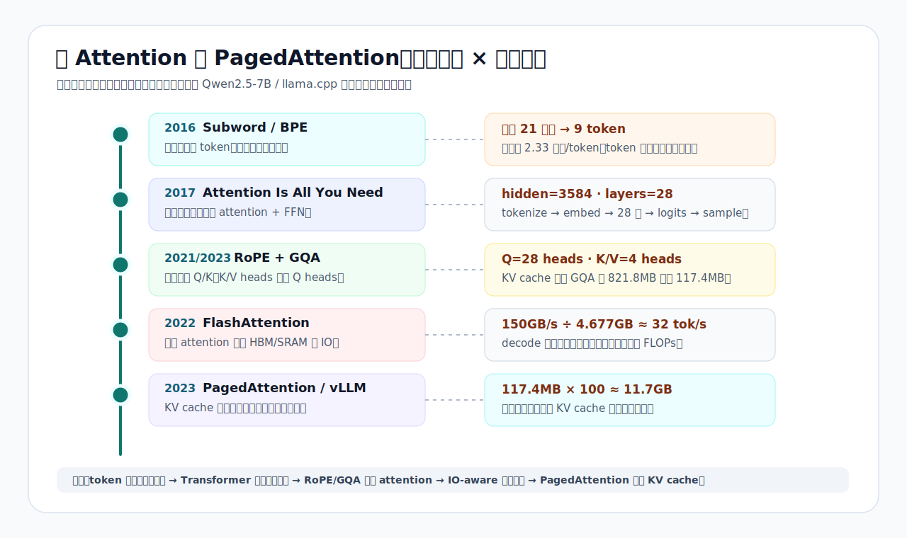
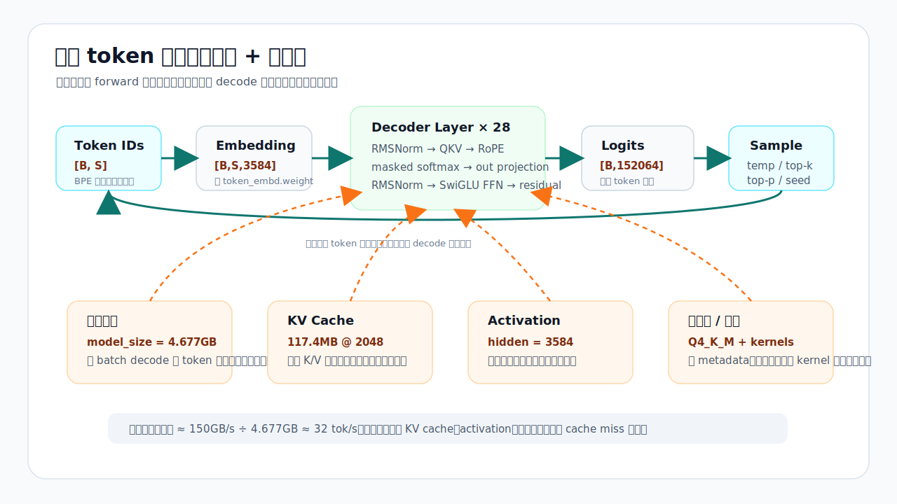

# 从 Attention 到 PagedAttention：用 llama.cpp 跑通 Qwen2.5-7B 后，我终于看懂了 LLM 推理主线

这两周我表面上是在学 `llama.cpp`：

```text
下载 Qwen2.5-7B Q4_K_M
拆 GGUF
跑 tokenizer
读 Qwen2 forward graph
算 KV cache
跑 llama-bench
跑 llama-perplexity
调 temp / top-k / top-p
```

但回头看，真正学到的不是“某个命令怎么用”，而是一条 AI Infra 的主线：

```text
LLM 推理系统，正在从“文本建模问题”一步步变成“内存与调度问题”。
```

这句话有点抽象。把论文和本机实验对上后，它变得很具体。



这篇不是论文综述，也不是 `llama.cpp` 使用教程。它更像一次复盘：用几篇关键论文当纵轴，用我在本机跑出的数字当横切面，把 Week 01-02 学到的东西串成一条连续逻辑。

如果只记一个问题，就是：

```text
从我敲下 prompt，到模型吐出下一个 token，中间到底发生了什么？
```

## 1. 第一层：文本为什么先变成 token

推理的第一步不是 attention，而是 tokenizer。

很多人会先以为：

```text
中文一个汉字一个 token
英文一个单词一个 token
```

这是错的。

Sennrich、Haddow、Birch 在 2016 年的 *Neural Machine Translation of Rare Words with Subword Units* 里，把 subword units 用在神经机器翻译里，核心动机是解决固定词表面对罕见词、未知词时的尴尬：不要只在“整词”和“字符”之间二选一，而是把文本表示成更小但仍有统计意义的子词片段。

这条思想落到今天的 LLM tokenizer 上，就是：

```text
token 不是人类看到的字，也不是严格的词；
它是 tokenizer 在训练语料里学出来的常见文本片段。
```

我用 Qwen2.5 tokenizer 跑了四组样本：

| 样本 | 字符数 | UTF-8 字节 | token 数 | 压缩比 |
|---|---:|---:|---:|---:|
| `你好，今天我们继续学习 AI Infra。` | 21 | 45 | 9 | 2.33 字符/token |
| `Today we continue learning AI infrastructure.` | 45 | 45 | 7 | 6.43 字符/token |
| `def hello(name): return f"hello {name}"` | 39 | 39 | 11 | 3.55 字符/token |
| `AI Infra 🚀🔥` | 11 | 17 | 7 | 1.57 字符/token |

中文样本最能打破直觉：

```text
21 个字符 -> 9 个 token
```

如果真是一个汉字一个 token，这里应该接近 21 个 token。真实结果是 9 个，因为 `"你好"`、`"今天我们"`、`"继续"`、`"学习"` 这类高频片段可以合并成 token。

反过来，emoji 样本只有 11 个字符，却用了 7 个 token。因为某些 emoji 可能被 byte-level BPE 切成多个 token。

所以 token 是第一道分界线：

```text
人类读字符；
模型读 token id。
```

这也是为什么 LLM 按 token 计费，而不是按字符计费。embedding 查表按 token id 发生，attention 的序列长度按 token 算，KV cache 也按 token 位置增长，decode 阶段每生成一个 token 就推进一次循环。

从这一刻起，文本已经不再是文本了。它变成了一串整数。

## 最小数学底座：后面只需要这几块

后面会出现一些公式，但这篇文章真正需要的数学不多。先把最小底座铺好。

第一块是向量。向量可以先理解成一串数字：

```text
[0.2, -1.1, 3.4, 0.7]
```

token id 本身只是整数，但 embedding 会把它查表变成一个向量。Qwen2.5-7B 的 hidden size 是 3584，意思就是每个 token 会被表示成 3584 个数字。

第二块是矩阵 shape。shape 只是“有多少行、每行多少列”。如果 16 个 token 每个都有 3584 个数字，就是：

```text
[16, 3584]
```

这不是玄学，只是 16 行、每行 3584 列。后面看到 `[S, 28, 128]`，也可以按这个思路读：序列长度 S，每个位置分成 28 个 head，每个 head 里有 128 个数字。

第三块是点积。点积就是对应位置相乘再相加：

```text
[1, 2] · [3, 4] = 1×3 + 2×4 = 11
```

attention 里 Q 和 K 的匹配分数，本质上就是点积。分数越高，表示当前 token 越应该关注那个历史 token。

第四块是 softmax。logits 只是原始分数，不是概率。softmax 会做三步：

```text
分数: [2, 1, 0]
取 exp: [7.39, 2.72, 1.00]
除以总和 11.11: [0.665, 0.245, 0.090]
```

所以 softmax 的作用是把任意分数变成概率分布。temperature 改的也是这一步：先把 logits 除以 T，再 softmax。T 小，分数差距被放大；T 大，分数差距被压平。

第五块是 log 和 exp。多个 token 的概率连乘会越来越小，不方便平均：

```text
0.5 × 0.25 × 0.1 = 0.0125
```

取 log 后，乘法会变成加法，所以交叉熵用的是平均负 log 概率。最后再用 exp 还原，就得到 PPL。可以把它理解成：模型平均面对多少个有效候选。

有了这五块，后面的 QKV、KV cache、PPL、sampling 都能读下去。

## 2. 第二层：Transformer 把 token 变成张量流

2017 年的 *Attention Is All You Need* 把主线往前推了一大步：序列建模不再依赖循环网络逐步扫过输入，而是用 attention 直接建模序列内部的关系。

论文里的大方向是：

```text
用 self-attention 和 feed-forward network 组成 Transformer；
去掉 recurrence 和 convolution；
提高并行性。
```

在我本机的 Qwen2.5-7B 上，这条思想落成了很具体的数字：

```text
hidden size = 3584
layers      = 28
Q heads     = 28
KV heads    = 4
head dim    = 128
vocab size  ≈ 152064
```

一次推理可以先粗略画成：

```text
tokenize
-> embed
-> 28 层 decoder block
-> final norm
-> output projection
-> logits
-> sample
```

如果 prompt 有 16 个 token，embedding 后就是：

```text
[16] -> [16, 3584]
```

每个 token id 去 `token_embd.weight` 里查一行，变成 3584 维向量。然后这批向量进入 28 层 decoder。最后只取最后一个位置的 hidden state，乘上 output 矩阵，得到对 15 万级候选 token 的打分：

```text
[1, 3584] -> [1, 152064]
```

这一步得到的是 logits。logits 不是概率，它只是模型对下一个 token 的原始偏好分。后面还要经过 softmax、temperature、top-k/top-p 等采样策略，才会选出真正输出的 token。

这已经能纠正一个常见误解：

```text
模型不是“直接说出一句话”。
模型每一步只是在 15 万级候选 token 上打分，然后选一个。
```



## 3. 第三层：Attention 内部不是一个黑盒

把 Transformer 继续拆开，一层 decoder block 里最关键的是 attention。

我现在会把 attention 拆成四步：

```text
QKV 投影
-> RoPE
-> masked softmax
-> out projection
```

### QKV：同一个 hidden，被投影成三种角色

进入 attention 前，每个 token 的 hidden 向量是 3584 维。

Qwen2.5-7B 里：

```text
Q: [S, 3584] -> [S, 28, 128]
K: [S, 3584] -> [S,  4, 128]
V: [S, 3584] -> [S,  4, 128]
```

Q 是 Query，表示当前 token 想找什么。K 是 Key，表示历史 token 能被什么问题匹配。V 是 Value，表示历史 token 被选中后贡献什么内容。

注意这里 Q 有 28 个 head，但 K/V 只有 4 个 head。这就是 GQA。

### RoPE：位置不是贴标签，而是旋转 Q/K

Transformer 必须知道 token 的位置，否则同一批 token 打乱顺序后很难区分。

RoFormer 论文提出的 RoPE 做法很漂亮：它不把位置向量简单加到 hidden 上，而是把位置变成旋转角度，作用在 Q 和 K 上。

最小直觉是：

```text
把一个 128 维 head 拆成 64 对二维坐标；
每一对坐标按当前位置旋转；
Q 和 K 点积时，相对位置就自然进入 attention score。
```

这就是为什么 RoPE 用高中三角函数就能解释。它的关键不是公式长，而是：

```text
位置进入了 Q/K 的几何关系。
```

### masked softmax：不能偷看未来

自回归语言模型生成第 t 个 token 时，只能看 t 之前的内容，不能看未来。

所以 attention score 里要加 causal mask。未来位置被压成近似 0 概率，再做 softmax。

对每个 Q head 来说，它会拿当前 query 去和历史 K 做点积：

```text
score = (Q @ K^T) / sqrt(head_dim)
```

Qwen2.5 的 head_dim 是 128，所以缩放项是：

```text
sqrt(128) ≈ 11.31
```

softmax 后得到的是 attention weight。再用这些 weight 对 V 做加权求和，得到每个 head 的输出。

### out projection：把多头结果重新混回 hidden

28 个 Q head 做完 attention 后，会得到：

```text
[S, 28, 128]
```

因为：

```text
28 × 128 = 3584
```

所以它可以 reshape 回：

```text
[S, 3584]
```

但 reshape 只是在排布维度，真正把不同 head 的信息混合起来的是 out projection：

```text
[S, 3584] -> W_o -> [S, 3584]
```

到这里，attention 才真正回到 decoder block 的主干，继续走 FFN 和 residual。

## 4. 第四层：GQA 把 attention 变成内存账

GQA 论文 *Training Generalized Multi-Query Transformer Models from Multi-Head Checkpoints* 讨论的是一个很现实的问题：MQA 只用一个 key-value head，可以显著加速 decoder 推理，但可能损失质量；GQA 在 multi-head attention 和 MQA 之间折中，用少量 KV heads 接近 MHA 的质量，同时接近 MQA 的速度。

我在 Qwen2.5-7B 上看到的正是这种折中：

```text
Q heads  = 28
KV heads = 4
```

这件事的意义不只在算子速度，更在 KV cache。

KV cache 的公式是：

```text
KV cache bytes
= layers × 2(K+V) × batch × KV_heads × seq × head_dim × bytes_per_value
```

代入 Qwen2.5-7B：

```text
layers = 28
K/V 两份 = 2
batch = 1
KV_heads = 4
seq = 2048
head_dim = 128
FP16 = 2 bytes
```

得到：

```text
28 × 2 × 1 × 4 × 2048 × 128 × 2
= 117,440,512 bytes
≈ 117.4 MB
```

如果没有 GQA，K/V heads 从 4 变成 28：

```text
117.4MB × (28 / 4) ≈ 821.8MB
```

100 并发时，GQA 版本光 KV cache 就是：

```text
117.4MB × 100 ≈ 11.7GB
```

这一步非常关键。attention 论文看起来是模型结构，GQA 看起来是 architecture trick，但到了推理系统里，它立刻变成一笔显存账。

也就是说：

```text
attention 决定怎么读上下文；
GQA 决定读上下文时要存多少 K/V；
KV cache 决定服务端一次能塞多少并发。
```

## 5. 第五层：prefill 和 decode 是同一个 forward 的两副面孔

`llama.cpp` 里没有神秘的“prefill 函数”和“decode 函数”完全分开。更准确地说，它们都走 decode/graph 这条主路径，差别在于本轮 batch 里装了多少 token。

prefill 阶段：

```text
一次处理整个 prompt
比如 [512, hidden] × weight
```

decode 阶段：

```text
每次只处理 1 个新 token
比如 [1, hidden] × weight
```

同一份权重，在 prefill 里可以服务很多 token；在小 batch decode 里，只服务一个 token。

这解释了我的 bench 数字：

| 配置 | prefill | decode |
|---|---:|---:|
| CPU / ngl=0 | 31.07 tok/s | 14.87 tok/s |
| Metal / ngl=99 | 510.84 tok/s | 18.42 tok/s |
| Metal / 6 threads | 485.69 tok/s | 18.72 tok/s |
| Metal / 12 threads | 506.97 tok/s | 18.69 tok/s |

Metal offload 下，prefill 从 31 tok/s 到 510 tok/s，暴涨。decode 只是从 14.9 tok/s 到 18.4 tok/s，提升很小。

这不是偶然。prefill 是大矩阵乘，更容易吃到并行计算；decode 是小 batch 自回归，每步都要重读大量权重和历史 KV，容易 memory-bound。

这里 AI Infra 的问题开始转向：

```text
不是“模型会不会算”，而是“数据怎么搬、batch 怎么拼、内存怎么管”。
```

## 6. 第六层：FlashAttention 提醒我们看 IO，而不是只看 FLOPs

FlashAttention 论文的关键词是 IO-aware。

它指出 long sequence attention 慢和吃内存，不只是因为算术复杂度高，还因为标准 attention 会在 GPU HBM 和片上 SRAM 之间产生大量读写。FlashAttention 用 tiling 减少 HBM 访问，在不近似 attention 的前提下提升实际速度和内存效率。

这篇论文对我理解本地推理有一个更宽的启发：

```text
推理性能不能只问 FLOPs。
还要问数据从哪里读，写到哪里，中间结果能不能少落回慢内存。
```

回到我的 decode 带宽公式：

```text
decode tok/s <= memory_bandwidth / bytes_per_token
```

最粗地估：

```text
bytes_per_token ≈ model_size
```

模型大小来自 `llama-bench`：

```text
model_size = 4.677GB
```

如果按 M5 Pro 统一内存带宽粗估：

```text
150GB/s / 4.677GB ≈ 32 token/s
```

这只是理论天花板。真实速度低于它，因为每个 token 不只读权重，还要读写 KV cache、搬 activation、处理 Q4_K_M 的反量化 metadata、承受 kernel 调度和 cache miss。

后来我专门把这件事拆成一篇 decode 访存开销笔记，核心结论是：

```text
权重决定第一阶上限；
KV cache 随上下文增长；
activation 是 forward 中的临时数据流；
量化降低权重大小，但引入解码成本；
kernel 调度和 cache miss 决定能否接近峰值带宽。
```

所以，FlashAttention 对这篇总结的价值不是“我已经实现了 FlashAttention”，而是它给了一个系统视角：

```text
LLM 推理优化，本质上越来越像 IO 工程。
```

## 7. 第七层：量化把“模型大小”变成速度问题

我这次跑的是：

```text
Qwen2.5-7B-Instruct-Q4_K_M.gguf
```

`llama-bench` 里模型大小是：

```text
4,677,120,000 bytes ≈ 4.677GB
```

如果是 FP16 7B 模型，权重体量会远大于这个数字。本地能跑起来，Q4_K_M 这种量化格式非常关键。

AWQ 论文从另一个方向说明了同一件事：LLM 权重很大，边缘设备和本地推理受硬件资源限制，因此 weight-only 低比特量化有实际价值。它还强调权重不是同等重要的，量化时要保护更关键的通道。

我这里没有做 AWQ 实验，也没有比较 Q4/Q5/Q8 的完整质量曲线。但 Q4_K_M 已经足够让我看到一个系统事实：

```text
量化不是只为省磁盘。
在 memory-bound decode 里，权重越小，每 token 需要搬的数据越少，速度天花板越高。
```

当然它有代价。Q4_K_M 不是直接拿 4bit 数字做矩阵乘。推理时要读低 bit 编码、scale/min 等 metadata，再反量化成可参与计算的近似权重。

所以量化也是一个 tradeoff：

```text
减少权重读取字节数；
增加反量化和格式处理；
可能带来质量损失。
```

这就是为什么 PPL 质量评估必须跟上。

## 8. 第八层：PPL 衡量分布质量，sampling 决定怎么取样

Day 10 我跑了 `llama-perplexity`：

```text
Qwen2.5-7B-Instruct-Q4_K_M
WikiText-2 validation
ctx=512, chunks=16
PPL = 6.8790 +/- 0.30335
```

PPL 可以先理解成：

```text
模型预测下一个 token 时的平均有效岔路数。
```

`PPL=6.879` 不是“错了 6.879 次”，而是模型在这段评测语料上的平均不确定性，大致像每一步在 6.879 个同样可能的候选里选。

公式上：

```text
cross_entropy = 平均负 log 概率
PPL = exp(cross_entropy)
```

PPL 衡量的是模型给真实下一个 token 分了多少概率质量。

但真正生成文本时，我们不只看 PPL，还要采样。

同一个 prompt：

```text
写一句关于秋天的诗。
```

我固定 `--seed 42`，跑了几组：

| 配置 | 输出 |
|---|---|
| `temp=0` | 秋风送爽叶纷飞，金黄铺满小径辉。 |
| `temp=0.7` | 秋风送爽叶纷飞，黄金满地映斜晖。 |
| `temp=1.5` | 秋风送爽叶纷飞，黄金遍地映斜晖。 |
| `temp=1.0 top-k=10` | 秋风送爽叶纷飞，黄金满地映斜晖。 |
| `temp=1.0 top-p=0.3` | 秋风送爽叶纷飞，金黄铺满小径辉。 |

这里可以看到：

```text
PPL / 交叉熵：评估模型分布质量
temperature / top-k / top-p：决定如何从分布里取样
```

它们不是一回事。

temperature 的位置是：

```text
softmax(logits / T)
```

`T -> 0` 时接近 argmax，最高 logit 赢家通吃。`T -> ∞` 时分布变平，接近均匀随机。

top-k 固定保留概率最高的前 k 个 token。top-p 保留累计概率达到 p 的最小 token 集合。

这组诗句没有因为高温而乱飞，主要只在“金黄/黄金”“铺满/满地/遍地”之间变化。原因是 prompt 约束强，模型本身已经把候选范围压得很窄。

所以最后一步也不是玄学：

```text
模型先给出概率分布；
sampling 再决定从这个分布里怎么选。
```

## 9. 第九层：为什么 vLLM / PagedAttention 必须出现

到这里，单机 `llama.cpp` 已经把一条完整推理链路跑通了。

但如果把它放进真实服务端，问题会立刻升级。

单请求时，KV cache 是：

```text
117.4MB @ seq=2048
```

100 并发时，是：

```text
11.7GB
```

如果上下文更长、模型更大、并发更多，KV cache 会迅速成为主角。

vLLM / PagedAttention 论文正是从这里切入。它的核心问题不是“attention 公式怎么变”，而是：

```text
LLM serving 需要足够大的 batch 才有高吞吐；
但每个请求的 KV cache 又巨大、动态增长、容易碎片化；
内存管理不好，就会限制 batch size。
```

PagedAttention 借鉴操作系统里的分页思想，把每个请求的 KV cache 分成固定大小 block，用 block table 把逻辑 block 映射到物理 GPU 内存 block。

这和我这两周学的内容正好接上：

```text
Transformer 让 attention 成为核心计算；
KV cache 让 decode 不用重算历史；
GQA 让 KV cache 小 7 倍；
FlashAttention 提醒我们 IO 才是实际性能关键；
PagedAttention 则把 KV cache 变成可调度、可分页、可共享的系统资源。
```

所以 Week 03-04 读 vLLM，不是另起炉灶。它是 Week 01-02 的自然延伸。

## 10. 把整条主线压成一张白板

如果面试官问：

```text
从 prompt 到第一个输出 token，中间发生了什么？
```

我现在会这样答：

```text
1. 文本先被 tokenizer 切成 token id。
2. token id 查 embedding 表，变成 hidden 向量。
3. hidden 进入 28 层 decoder，每层做 RMSNorm、QKV、RoPE、masked attention、out projection、FFN 和 residual。
4. Qwen2.5-7B 用 GQA：Q 有 28 个 head，K/V 只有 4 个 head，head_dim=128。
5. prefill 阶段一次处理整个 prompt，并把每层 K/V 写入 KV cache。
6. decode 阶段每次只生成 1 个 token，读取历史 KV cache，追加新 K/V。
7. 最后一层 hidden 乘 output 矩阵得到 logits，再通过 softmax 和 sampling 选出下一个 token。
8. 性能上，prefill 更像大矩阵乘，decode 小 batch 更受权重读取和 KV cache IO 限制。
```

如果追问：

```text
为什么 vLLM 这种系统会存在？
```

我会接着说：

```text
因为单请求推理只解决了“能不能算”；
服务端推理还要解决“并发请求的 KV cache 怎么放、怎么共享、怎么避免碎片化、怎么把 batch 做大”。
```

这就是从 Attention 到 PagedAttention 的连续逻辑。

## 11. 我学到的最反直觉的一点

刚开始我以为 AI Infra 的主线会是：

```text
算子越快越好，GPU 越强越好。
```

现在我更愿意说：

```text
真正的主线是数据复用。
```

tokenizer 是把字符复用成高频片段。Transformer 是让序列位置之间直接复用信息。KV cache 是复用历史 K/V，避免重算。GQA 是让多个 Q head 共享更少的 K/V。FlashAttention 是复用片上 SRAM，减少 HBM 往返。PagedAttention 是复用和管理 KV cache block，让 serving batch 能做大。

它们看起来分属 NLP、模型结构、推理引擎、系统调度，但其实都在回答同一个问题：

```text
哪些东西值得保存？
哪些东西应该重算？
哪些东西能共享？
哪些东西必须搬到更近的地方？
```

这就是我这两周真正拿到的东西。

## 12. 参考论文和材料

- Rico Sennrich, Barry Haddow, Alexandra Birch. [Neural Machine Translation of Rare Words with Subword Units](https://aclanthology.org/P16-1162/). ACL 2016.
- Ashish Vaswani et al. [Attention Is All You Need](https://arxiv.org/abs/1706.03762). arXiv 2017.
- Jianlin Su et al. [RoFormer: Enhanced Transformer with Rotary Position Embedding](https://arxiv.org/abs/2104.09864). arXiv 2021.
- Joshua Ainslie et al. [GQA: Training Generalized Multi-Query Transformer Models from Multi-Head Checkpoints](https://arxiv.org/abs/2305.13245). arXiv 2023.
- Tri Dao et al. [FlashAttention: Fast and Memory-Efficient Exact Attention with IO-Awareness](https://arxiv.org/abs/2205.14135). arXiv 2022.
- Ji Lin et al. [AWQ: Activation-aware Weight Quantization for LLM Compression and Acceleration](https://arxiv.org/abs/2306.00978). arXiv 2023.
- Woosuk Kwon et al. [Efficient Memory Management for Large Language Model Serving with PagedAttention](https://arxiv.org/abs/2309.06180). arXiv 2023.

## 13. 自测

1. 为什么 token 不是字符？用这次中文实验的真实数字说明。
2. `hidden=3584`、`Q heads=28`、`head_dim=128` 三者是什么关系？
3. 为什么 GQA 会让 KV cache 变小？Q heads 和 KV heads 各是多少？
4. 为什么 prefill 在 Metal offload 下能暴涨，而 decode 提升很有限？
5. PPL 和 sampling 分别衡量/决定什么？
6. 为什么 PagedAttention 是 Week 01-02 的自然下一步？

能把这六题讲清楚，`llama.cpp 一次 forward 都做了什么` 这篇交付物就不是流水账，而是一个可复用的推理系统心智模型。
